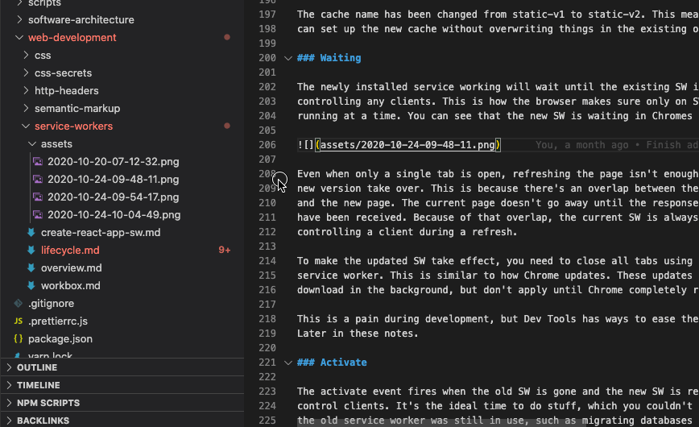

# Markdown Link Updater

## Features

Updates Markdown links automatically, when files in the workspace are moved or renamed.

## Extension Settings

This extension contributes the following settings:

- `markdownLinkUpdater.slowUseGitIgnore`: Skip files that are ignored by git. This can be SLOW on large projects, so it is encouraged to activate it on a per project basis. Default value is false.

## Release Notes

### 1.0.0

Initial release of markdown-link-updater
